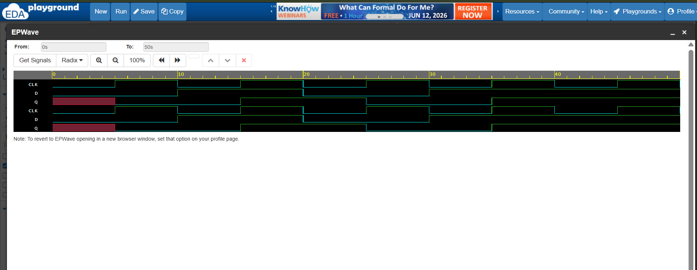
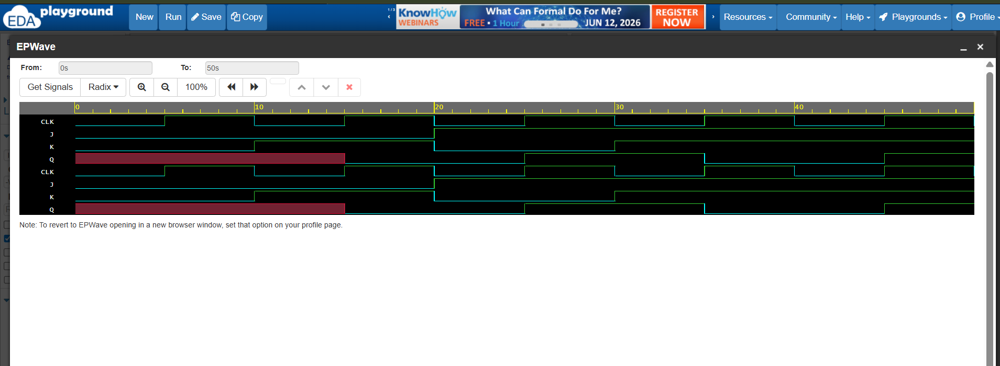
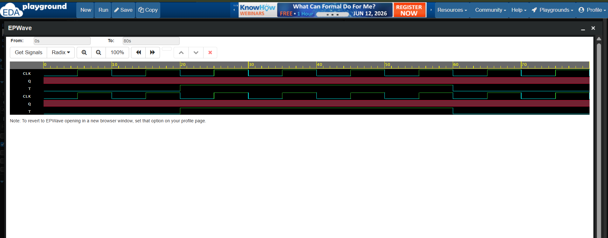
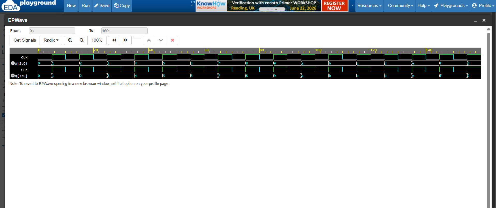

# Verilog Sequential Logic

## Overview

This repository contains a collection of fundamental **Sequential Logic Circuits** implemented using **Verilog HDL**. Each project was designed, simulated, and verified using **EDA Playground** and **EPWave**.

The objective of this repository is to strengthen the understanding of clocked digital systems through hands-on implementation of flip-flops, shift registers, and counters.

---

## Projects Included

| Project | Description |
|-----------|-------------|
| D Flip-Flop | Edge-triggered data storage element |
| JK Flip-Flop | Supports Hold, Reset, Set, and Toggle operations |
| T Flip-Flop | Toggle flip-flop used in counters |
| 4-Bit Shift Register | Serial data shifting through multiple stages |
| 4-Bit Up Counter | Binary counting sequence using clock pulses |

---

## Repository Structure

```text
Verilog-Sequential-Logic/
│
├── D_FlipFlop/
│   ├── d_flipflop.v
│   ├── d_flipflop_tb.v
│   └── d_flipflop_waveform.png
│
├── JK_FlipFlop/
│   ├── jk_flipflop.v
│   ├── jk_flipflop_tb.v
│   └── jk_flipflop_waveform.png
│
├── T_FlipFlop/
│   ├── t_flipflop.v
│   ├── t_flipflop_tb.v
│   └── t_flipflop_waveform.png
│
├── Shift_Register/
│   ├── shift_register_4bit.v
│   ├── shift_register_4bit_tb.v
│   └── shift_register_waveform.png
│
├── Counter_4Bit/
│   ├── counter_4bit.v
│   ├── counter_4bit_tb.v
│   └── counter_4bit_waveform.png
│
└── README.md
```

---

# D Flip-Flop

## Truth Table

| Clock Edge | D | Q(next) |
|------------|---|----------|
| ↑ | 0 | 0 |
| ↑ | 1 | 1 |

### Waveform



---

# JK Flip-Flop

## Truth Table

| J | K | Q(next) | Operation |
|---|---|----------|------------|
| 0 | 0 | Q | Hold |
| 0 | 1 | 0 | Reset |
| 1 | 0 | 1 | Set |
| 1 | 1 | Q̅ | Toggle |

### Waveform



---

# T Flip-Flop

## Truth Table

| T | Q(next) | Operation |
|---|----------|------------|
| 0 | Q | Hold |
| 1 | Q̅ | Toggle |

### Waveform



---

# 4-Bit Shift Register

## Working Principle

A 4-bit Serial-In Serial-Out (SISO) Shift Register transfers data from one stage to the next on every rising edge of the clock.

Example sequence:

```text
Initial State : 0000

Input D = 1

Clock 1 → 0001
Clock 2 → 0011
Clock 3 → 0111
Clock 4 → 1111
```

### Waveform


---

# 4-Bit Up Counter

## Counting Sequence

The counter increments its value by one on every rising edge of the clock.

```text
0000
0001
0010
0011
0100
0101
0110
0111
1000
1001
1010
1011
1100
1101
1110
1111
0000
```

### Waveform



---

## Tools Used

- Verilog HDL
- EDA Playground
- EPWave
- GitHub

---

## Learning Outcomes

Through these projects, I gained practical experience in:

- Sequential Logic Design
- Verilog HDL Programming
- Clocked Circuit Design
- Testbench Development
- Functional Verification
- Waveform Analysis and Debugging
- Hardware Modeling and Simulation

---

## Future Enhancements

This repository will be expanded with more advanced sequential and communication projects, including:

- Finite State Machines (FSMs)
- Traffic Light Controller
- Arithmetic Logic Unit (ALU)
- UART Transmitter
- UART Receiver
- FPGA-Oriented Designs

---

## Author

**Aneesa Pattan**  
Electronics and Communication Engineering (ECE) Student

---

### If you found this repository useful, feel free to ⭐ star the repository and connect with me.
